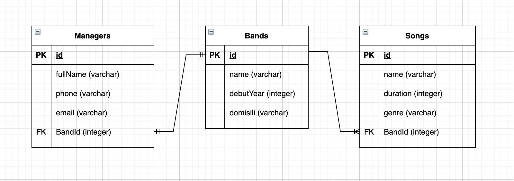

# Sequelize Association

## 1 to 1 & 1 to Many

### Study Case

- Setiap band hanya memiliki 1 manager dan satu manager hanya menangani 1 band.
- Band memiliki informasi mengenai name, debutYear, dan domisili.
- Manager harus memiliki nama lengkap ,nomer telepon, dan email.
- Band bisa membuat banyak lagu dengan genre Pop, Rock, Metal dan Indie.
- Lagu-lagu yang dibuat band harus memiliki informasi name, duration, genre.
- Setiap lagu yang sudah di perkenalkan tidak boleh untuk dihapus dan edit.

> Buat table dan buatlah seeder sesuai cerita di atas

> Gunakan database bernama `H8-Bands`

> Tentukan relasi one to one dan one to many

### Kerjakan semua point berikut :

1. Tampilkan seluruh band berserta managernya
2. Tampilkan data band dan semua relasinya
3. Tampilkan 1 lagu dengan informasi band pembuatnya.

---

## Association

One to One :

- Satu Band memiliki satu Manager dan satu Manager dimiliki satu Band
- One Band has one Manager and one Manager belongs to one Band

One to Many :

- Satu Band memiliki banyak Song dan satu Song dimiliki satu Band
- One band has many Songs and one song belongs to one band

### Step by step

- npm init -y
- create gitignore
- install package: sequelize, pg dan express
- sequelize init
